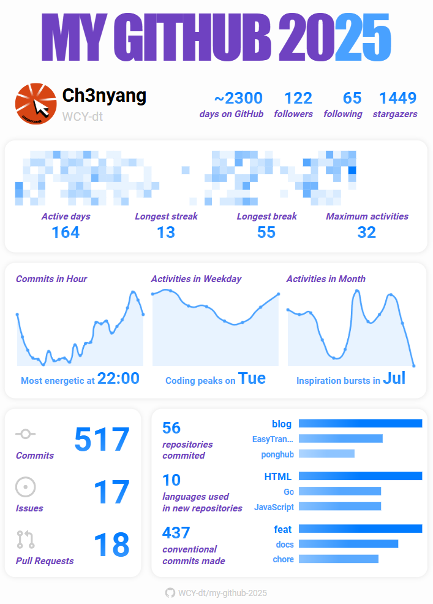

<div align="center">
  

  统计 2025 年你在 GitHub 上的活动.

  [English](README.md) | 简体中文

  [](https://2025.ch3nyang.top)

  [](https://github.com/WCY-dt/my-github-2025/issues) [](https://github.com/WCY-dt/my-github-2025/pulls) [](https://github.com/WCY-dt/my-github-2025/blob/main/LICENSE)

  <strong style="font-size: 24px;">👉 立即体验: <a href="https://2025.ch3nyang.top">https://2025.ch3nyang.top</a></strong>
</div>

## 示例



## 使用方法

> [!TIP]
>
> **新功能**：现在支持选择 2008 年至 2025 年的任意年份生成报告。

1. 访问 [https://2025.ch3nyang.top](https://2025.ch3nyang.top)。

2. 点击 `Sign in with GitHub` 按钮，授权登录。

3. 选择你所在的时区和需要生成的年份，然后点击 `Generate` 按钮，稍等几秒，即可查看 2025 年你在 GitHub 上的活动。

## 本地运行

> [!IMPORTANT]
>
> 受到 `datetime` 库特性影响，本项目需要 Python-3.12 及以上版本。

1. 克隆仓库：

    ```bash
    git clone https://github.com/WCY-dt/my-github-2025.git
    cd my-github-2025
    ```

2. 创建 Github OAuth App：

    访问 [GitHub Developer Settings](https://github.com/settings/developers) 创建一个新的 OAuth App。其中，`Homepage URL` 和 `Authorization callback URL` 分别填写 `http://127.0.0.1:5000` 和 `http://127.0.0.1:5000/callback`。

    获取 `Client ID` 和 `Client Secret`。

3. 在项目根目录下配置环境变量 `.env` 文件内容形如：

    ```env
    CLIENT_ID=your_client_id
    CLIENT_SECRET=your_client_secret
    ```

4. 安装依赖：

    ```bash
    pip install -r requirements.txt
    ```

5. 运行：

    ```bash
    python my-github-2025.py
    ```

6. 访问 `http://127.0.0.1:5000` 即可查看效果。
